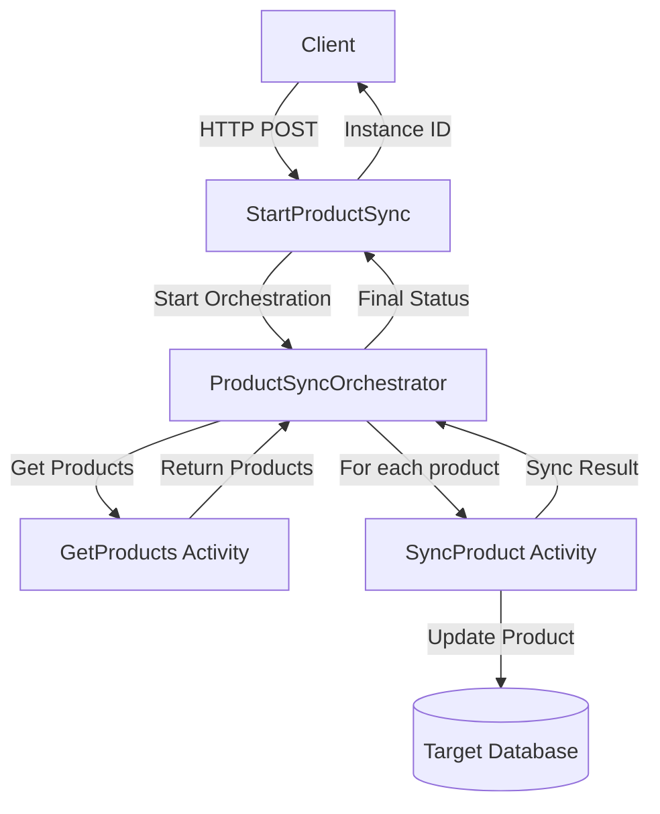

# Azure Function App with Dual Database Sync

This project implements an Azure Functions application using Node.js 20 that provides CRUD operations for users and products, with automatic synchronization between two databases. It uses Sequelize ORM with MSSQL as primary database and PostgreSQL as fallback.

## Features

- CRUD operations for Users and Products
- Automatic database fallback from MSSQL to PostgreSQL
- Daily product synchronization using timer trigger
- On-demand product synchronization using Durable Functions
- Real-time product sync between databases

## Prerequisites

- Node.js 20.x
- Azure Functions Core Tools v4
- PostgreSQL database
- MSSQL database (optional)
- Azurite (for local storage emulation)

## Installation

1. Clone the repository
2. Install dependencies:
   ```bash
   npm install
   ```
3. Install Azure Functions Core Tools and Azurite:
   ```bash
   npm install -g azure-functions-core-tools@4 --prefix ~/.npm-global
   npm install -g azurite
   ```
4. Copy `.env.example` to `.env` and update the configuration:
   ```bash
   cp .env.example .env
   ```
5. Initialize the database with sample data:
   ```bash
   node scripts/initDb.js
   ```

## Running the Application

1. Start Azurite (storage emulator):
   ```bash
   azurite --silent --location /tmp/azurite --debug /tmp/azurite/debug.log
   ```

2. Start the Azure Functions app:
   ```bash
   func start
   ```

## API Documentation

### Product Management APIs

1. **Create Product**
   ```bash
   curl -X POST http://localhost:7071/api/products \
   -H "Content-Type: application/json" \
   -d '{
     "name": "Test Product",
     "description": "Test Description",
     "price": 299.99
   }'
   ```
   Response:
   ```json
   {
     "id": 6,
     "name": "Test Product",
     "description": "Test Description",
     "price": "299.99",
     "createdAt": "2025-03-24T05:23:54.611Z",
     "updatedAt": "2025-03-24T05:23:54.611Z"
   }
   ```

2. **Get All Products**
   ```bash
   curl http://localhost:7071/api/products
   ```
   Response:
   ```json
   [
     {
       "id": 1,
       "name": "Updated Product",
       "description": "Updated Description",
       "price": "399.99",
       "createdAt": "2025-03-24T04:58:33.403Z",
       "updatedAt": "2025-03-24T05:23:54.677Z"
     },
     ...
   ]
   ```

3. **Get Product by ID**
   ```bash
   curl http://localhost:7071/api/products/1
   ```
   Response:
   ```json
   {
     "id": 1,
     "name": "Updated Product",
     "description": "Updated Description",
     "price": "399.99",
     "createdAt": "2025-03-24T04:58:33.403Z",
     "updatedAt": "2025-03-24T05:23:54.677Z"
   }
   ```

4. **Update Product**
   ```bash
   curl -X PUT http://localhost:7071/api/products/1 \
   -H "Content-Type: application/json" \
   -d '{
     "name": "Updated Product",
     "description": "Updated Description",
     "price": 399.99
   }'
   ```
   Response:
   ```json
   {
     "id": 1,
     "name": "Updated Product",
     "description": "Updated Description",
     "price": "399.99",
     "createdAt": "2025-03-24T04:58:33.403Z",
     "updatedAt": "2025-03-24T05:23:54.677Z"
   }
   ```

### Product Synchronization APIs (Azure Durable Functions)

1. **Start Manual Product Sync**
   ```bash
   curl -X POST http://localhost:7071/api/start-product-sync/ProductSyncOrchestrator
   ```
   Response:
   ```json
   {
     "id": "c0a026ddf7fa419f8d37f726279c8ee2",
     "status": {
       "name": "ProductSyncOrchestrator",
       "instanceId": "c0a026ddf7fa419f8d37f726279c8ee2",
       "runtimeStatus": "Pending",
       "input": "",
       "customStatus": null,
       "output": null,
       "createdTime": "2025-03-24T05:24:03Z",
       "lastUpdatedTime": "2025-03-24T05:24:03Z"
     },
     "message": "Product sync orchestration started"
   }
   ```

2. **Check Sync Status**
   ```bash
   curl http://localhost:7071/runtime/webhooks/durabletask/instances/
   ```
   Response:
   ```json
   [
     {
       "name": "ProductSyncOrchestrator",
       "instanceId": "c0a026ddf7fa419f8d37f726279c8ee2",
       "runtimeStatus": "Completed",
       "input": "",
       "customStatus": null,
       "output": [
         {"status": "updated", "id": 1},
         {"status": "updated", "id": 2},
         {"status": "updated", "id": 3},
         {"status": "updated", "id": 4},
         {"status": "updated", "id": 5},
         {"status": "updated", "id": 6}
       ],
       "createdTime": "2025-03-24T05:24:03Z",
       "lastUpdatedTime": "2025-03-24T05:24:04Z"
     }
   ]
   ```

## Automatic Synchronization

The application includes two types of synchronization:

1. **Real-time Sync**: Products are automatically synchronized to the first database whenever they are created, updated, or deleted in the second database.

2. **Daily Sync**: A timer-triggered function runs every day at 12:00 AM to ensure all products are synchronized between databases.

## Database Configuration

The application supports two database configurations:

1. **Primary (MSSQL)**:
   - Configure in `.env` using `DB1_*` variables
   - Requires valid MSSQL connection details

2. **Fallback (PostgreSQL)**:
   - Configure in `.env` using `PG_*` variables
   - Used automatically if MSSQL connection fails
   - Requires PostgreSQL installation and valid credentials

## Error Handling

The application includes comprehensive error handling:
- Database connection failures with automatic fallback
- Input validation
- Not found errors
- Server errors with detailed logging

## Azure Durable Functions Architecture

### Overview
Azure Durable Functions is an extension of Azure Functions that enables you to write stateful functions in a serverless compute environment. In our application, we use it to orchestrate the product synchronization process between databases.

### Components

1. **Client Function (`StartProductSync/index.js`)**
   - HTTP-triggered function that starts the orchestration
   - Returns an orchestration instance ID for status tracking
   - Endpoint: `POST /api/start-product-sync/ProductSyncOrchestrator`

2. **Orchestrator Function (`ProductSyncOrchestrator/index.js`)**
   - Coordinates the execution of activity functions
   - Maintains state and handles failures
   - Sequence:
     1. Gets products from source database
     2. For each product, calls sync activity
     3. Returns sync results

3. **Activity Functions**
   - `GetProducts/index.js`: Retrieves products from source database
   - `SyncProduct/index.js`: Syncs individual product to target database

### Data Flow



### State Management
- Orchestrator maintains execution history
- Automatic checkpointing after each activity
- Replay-safe execution for reliability

## Development Guide

### Setting Up Local Development

1. **Prerequisites Installation**:
   ```bash
   # Install Azure Functions Core Tools
   npm install -g azure-functions-core-tools@4
   
   # Install Azurite for local storage emulation
   npm install -g azurite
   ```

2. **Environment Configuration**:
   ```bash
   # Copy environment template
   cp .env.example .env
   
   # Update database configurations in .env
   ```

3. **Database Setup**:
   ```bash
   # Initialize and seed database
   npm run db:reset
   ```

### Creating New Functions

1. **HTTP-Triggered Function**:
   ```bash
   func new --name MyNewFunction --template "HTTP trigger" --authlevel "anonymous"
   ```

2. **Durable Function Components**:
   ```bash
   # Create orchestrator
   func new --name MyOrchestrator --template "Durable Functions orchestrator"
   
   # Create activity function
   func new --name MyActivity --template "Durable Functions activity"
   ```

### Testing Functions

1. **Start Local Environment**:
   ```bash
   # Start Azurite in background
   azurite --silent --location /tmp/azurite --debug /tmp/azurite/debug.log &
   
   # Start function app
   npm start
   ```

2. **Testing Endpoints**:
   - Use provided curl commands in API Documentation
   - Monitor function logs in console
   - Check Azurite debug logs for storage operations

### Best Practices

1. **Durable Functions**:
   - Keep orchestrator functions pure and deterministic
   - Move external calls to activity functions
   - Handle timeouts and retries appropriately
   - Use sub-orchestrations for complex workflows

2. **Error Handling**:
   - Implement proper error handling in activity functions
   - Use try-catch blocks in orchestrators
   - Log errors with sufficient context
   - Return meaningful error messages

3. **Database Operations**:
   - Use transactions where appropriate
   - Implement proper connection pooling
   - Handle database failover scenarios
   - Validate data before operations

4. **Monitoring**:
   - Use application insights for production
   - Monitor orchestration status
   - Track database performance
   - Set up alerts for failures

## Running the Application

1. Start Azurite:
   ```bash
   azurite --silent --location /tmp/azurite --debug /tmp/azurite/debug.log
   ```

2. Start the Azure Functions app:
   ```bash
   func start
   ```

The application will be available at `http://localhost:7071`.
